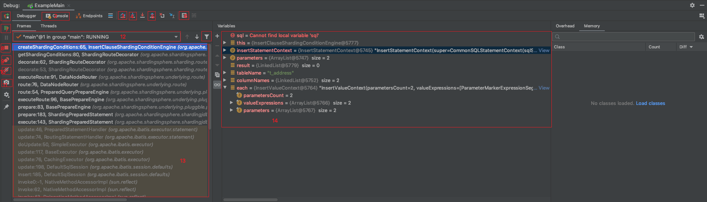
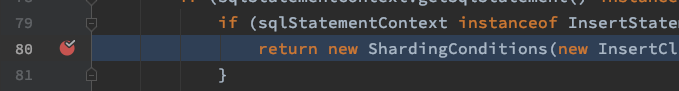

# IDEA　入门

## Debug 调试

关键字
* 进程：被计算机加载至内存中并执行的代码
* 线程：cpu 分配执行任务的工人
* 应用: 项目代码跑起来的进程
* 调试: 通过上帝视角查看进程状态与信息
* 断点: 调试模试下执行至该行代码暂停所有线程执行
* 堆栈: 线程执行Java 方法的集合
* 变量：方法中每个`=`的左边字符串所代表的数据

1. 重启当前应用
2. 查看当前应用日志输出
3. 执行当前行代码到一下行
4. 进入当前行方法
5. 执行当前行方法到返回上一自处
6. 打开面板执行一串 java 代码
7. 恢复进程执行
8. 停止当前应用
9. 查看当前项目所有断点列表
10. 禁用所有断点
11. 抓取应用当前所有线程信息
12. 当前线程信息（线程名＋线程 ID＋线程组名＋线程状态）
13. 当前线程堆栈信息
14. 当前线程执行该方法的所有变量

打断点：在代码行左边数字空白处单击鼠标左键即可打上断点