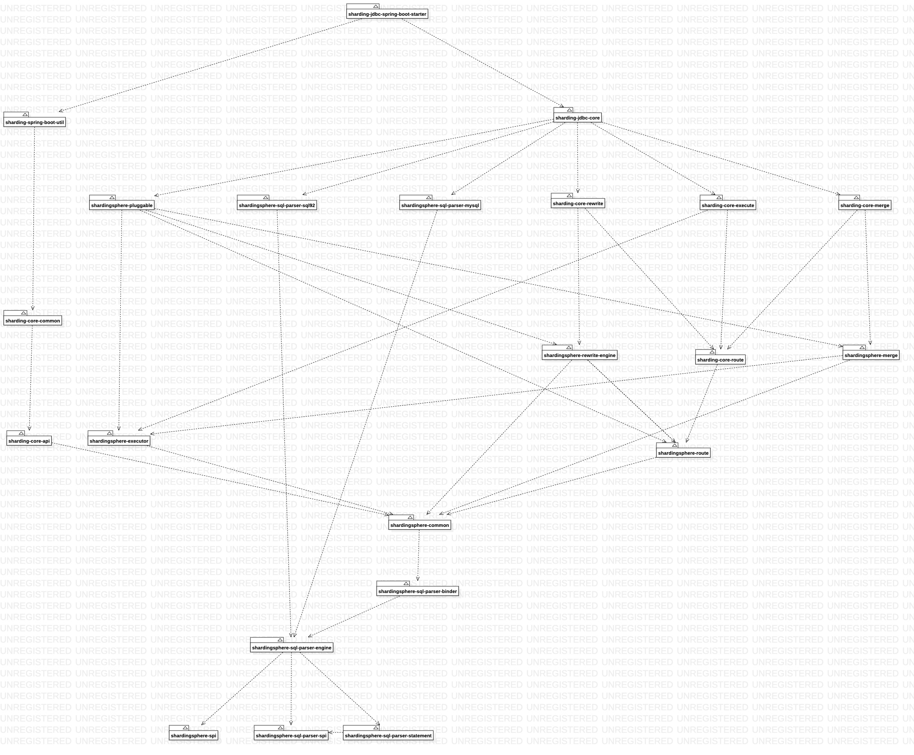
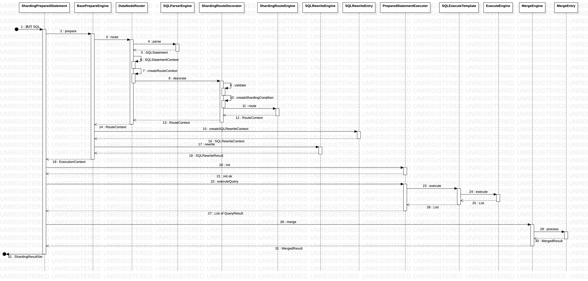

＃ 数据分片

本功能以 sharding-jdbc 功能视角去描述

## 核心概念

* 逻辑表：水平拆分的数据库（表）的相同逻辑和数据结构表的总称
* 真实表：在分片的数据库中真实存在的物理表
* 数据节点：数据分片的最小单元，由数据源名称和数据表组成
* 绑定表：指分片规则一致的主表和子表
* 广播表: 指所有的分片数据源中都存在的表，表结构和表中的数据在每个数据库中均完全一致
* 单表：指所有的分片数据源中只存在唯一一张的表

## 模块结构

数据分片主要功能实现涉及以下模块：



* sharding-spring：基于 spring 技术底座的 shardingsphere 集成

| 模块　|　描述　|
| :--: | :--: |  
| sharding-jdbc-spring-boot-starter | 提供 springboot 快速集成包 |
| sharding-jdbc-spring-namespace | 提供Spring　XML配置命名空间支持 |

* sharding-jdbc：针对 JDBC 层提供 ShardingSphere 功能扩展点

| 模块　|　描述　|
| :--: | :--: |  
| sharding-jdbc-core | JDBC 适配层 |

* shardingsphere-underlying: 提供 shardingsphere 基础内核抽象层

| 模块　|　描述　|
| :--: | :--: |  
| shardingsphere-route | 提供路由 SPI 抽象　|
| shardingsphere-rewirte | 提供改写 SPI 抽象 |
| shardingsphere-execute | 提供执行 SPI 抽象 |
| shardingsphere-merge | 提供归并 SPI 抽象 |
| shardingsphere-common | 提供Yaml配置与规则对象互转机制, 元数据处理，异常基类，工具类等 |
| shardingsphere-pluggable | |

* sharding-core:　数据分片内核具体实现

| 模块　|　描述　|
| :--: | :--: |  
| sharding-core-api | 提供自定义分片算法 API 及 分片键生成算法　SPI |
| sharding-core-common | 通用配置模型、分片键生成算法通用实现 |
| sharding-core-route | 路由引擎，将SQL解析结果通过分片策略进行计算目标数据节点, 提供多种分片策略支持 |
| sharding-core-rewrite | 改写引擎，按路由结果进行SQL语句改写，包括正确性改写与优化性改写两部份 |
| sharding-core-execute | 执行引擎，负责将改写完成之后的真实 SQL 安全且高效发送到底层数据源执行 |
| sharding-core-merge | 归并引擎，将从各个数据节点获取的多数据结果集，组合成为一个结果集并正确的返回至请求客户端 |

## 总体流程

1.　ShardingSphere　内核启动

正常情况下 ShardingSphere　内核是在 SpringJDBC 之前加载启动

1.1 配置加载

```java
@EnableConfigurationProperties({
        SpringBootShardingRuleConfigurationProperties.class,
        SpringBootMasterSlaveRuleConfigurationProperties.class, SpringBootEncryptRuleConfigurationProperties.class,
        SpringBootPropertiesConfigurationProperties.class, SpringBootShadowRuleConfigurationProperties.class})
```

1.2 数据源加载

* 自动装配类中实现了EnvironmentAware接口，该接口将会在 Spring　容器创建该配置类时调用，根据`Environment` 对象获取数据源配置并手动解析（因不限定数据源类型，配置结构不固定）

```java
public class SpringBootConfiguration implements EnvironmentAware {
    @Override
    public final void setEnvironment(final Environment environment) {
        String prefix = "spring.shardingsphere.datasource.";
        for (String each : getDataSourceNames(environment, prefix)) {
            try {
                dataSourceMap.put(each, getDataSource(environment, prefix, each));
            } catch (final ReflectiveOperationException ex) {
                throw new ShardingSphereException("Can't find datasource type!", ex);
            } catch (final NamingException namingEx) {
                throw new ShardingSphereException("Can't find JNDI datasource!", namingEx);
            }
        }
    }
}
```

* 解析`spring.shardingsphere.datasource.name`或`spring.shardingsphere.datasource.names`配置，进行行表达式运算并获取对应的数据源 ID 列表

```java
private List<String> getDataSourceNames(final Environment environment, final String prefix) {
    StandardEnvironment standardEnv = (StandardEnvironment) environment;
    standardEnv.setIgnoreUnresolvableNestedPlaceholders(true);
    return null == standardEnv.getProperty(prefix + "name")
            ? new InlineExpressionParser(standardEnv.getProperty(prefix + "names")).splitAndEvaluate() : Collections.singletonList(standardEnv.getProperty(prefix + "name"));
}
```

* 获取`spring.shardingsphere.datasource.数据源ID`对应的数据源配置，支持两种数据源实例管理方式
1. 利用反射实现数据源实例的创建与属性的设置
2. 直接加载已存在于Spring容器中的数据源


```java
private DataSource getDataSource(final Environment environment, final String prefix, final String dataSourceName) throws ReflectiveOperationException, NamingException {
    Map<String, Object> dataSourceProps = PropertyUtil.handle(environment, prefix + dataSourceName.trim(), Map.class);
    Preconditions.checkState(!dataSourceProps.isEmpty(), "Wrong datasource properties!");
    if (dataSourceProps.containsKey(jndiName)) {
        return getJndiDataSource(dataSourceProps.get(jndiName).toString());
    }
    DataSource result = DataSourceUtil.getDataSource(dataSourceProps.get("type").toString(), dataSourceProps);
    DataSourcePropertiesSetterHolder.getDataSourcePropertiesSetterByType(dataSourceProps.get("type").toString()).ifPresent(
        dataSourcePropertiesSetter -> dataSourcePropertiesSetter.propertiesSet(environment, prefix, dataSourceName, result));
    return result;
}
```

* JNDI 数据源加载，如果该数据源已存在于 Spring 容器中，ShardingSphere　支持直接引用该数据源，而无需创建一个新的数据源实例

```java
private DataSource getJndiDataSource(final String jndiName) throws NamingException {
    JndiObjectFactoryBean bean = new JndiObjectFactoryBean();
    bean.setResourceRef(true);
    bean.setJndiName(jndiName);
    bean.setProxyInterface(DataSource.class);
    bean.afterPropertiesSet();
    return (DataSource) bean.getObject();
}
```

* 读取分片规则配置并转化为分片规则对象，创建分片数据源

```java
@Bean
@Conditional(ShardingRuleCondition.class)
public DataSource shardingDataSource() throws SQLException {
    return ShardingDataSourceFactory.createDataSource(dataSourceMap, new ShardingRuleConfigurationYamlSwapper().swap(shardingRule), props.getProps());
}
```

2. ShardingSphere SQL 语句执行



2.1 内核剖析


* [解析引擎](content/parser/index.md)
* [路由引擎](content/router/index.md)
* [改写引擎](content/rewriter/index.md)
* [执行引擎](content/executor/index.md)
* [归并引擎](content/merge/index.md)