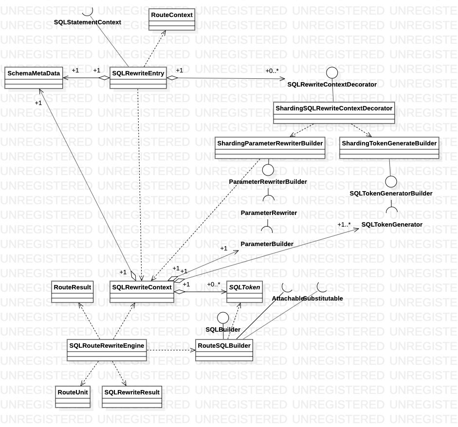

# 改写引擎

改写功能主要由`sharding-core/sharding-core-rewrite`模块实现，负责根据路由引擎计算的路由结果情况，进行改写生成对应的`ExecutionUnit`。其中，关键类如下图所示：

* `SQLRewriteEntry`： 改写功能入口，负责构建`SQLRewriteContext`，将改写的核心逻辑实现交给
* `SQLRewriteContextDecorator`： 预留的核心逻辑 SPI，支持改写功能扩展
* `ShardingSQLRewriteContextDecorator`： 数据分片改写功能默认实现
* `SQLRewriteContext`: 改写上下文
* `ParameterRewriter`: 预留的核心逻辑 SPI，提供JDBC参数改写功能扩展
* `SQLTokenGenerator`: 预留的核心逻辑 SPI，提供SQL语句改写功能扩展
* `SQLRouteRewriteEngine`: 按照 `RouteUnit` 列表改写SQL和对应的参数
* `SQLToken`: SQL 语句限定范围的字符串
* `RouteSQLBuilder`: 根据 `RouteUnit`　生成改写后 SQL 字符串

1. 核心流程实现

2. 改写核心逻辑实现

* `TableTokenGenerator`：表名修正
* `DistinctProjectionPrefixTokenGenerator`：
* `ProjectionsTokenGenerator`
* `OrderByTokenGenerator`
* `AggregationDistinctTokenGenerator`
* `IndexTokenGenerator`
* `OffsetTokenGenerator`
* `RowCountTokenGenerator`
* `GeneratedKeyInsertColumnTokenGenerator`
* `GeneratedKeyInsertColumnTokenGenerator`
* `GeneratedKeyForUseDefaultInsertColumnsTokenGenerator`
* `GeneratedKeyAssignmentTokenGenerator`
* `ShardingInsertValuesTokenGenerator`
* `GeneratedKeyInsertValuesTokenGenerator`
