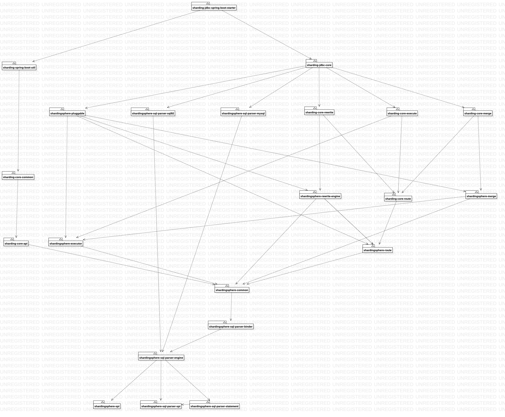

# 改写引擎

1. 改写核心逻辑实现

* `TableTokenGenerator`：表名修正
* `DistinctProjectionPrefixTokenGenerator`：
* `ProjectionsTokenGenerator`
* `OrderByTokenGenerator`
* `AggregationDistinctTokenGenerator`
* `IndexTokenGenerator`
* `OffsetTokenGenerator`
* `RowCountTokenGenerator`
* `GeneratedKeyInsertColumnTokenGenerator`
* `GeneratedKeyInsertColumnTokenGenerator`
* `GeneratedKeyForUseDefaultInsertColumnsTokenGenerator`
* `GeneratedKeyAssignmentTokenGenerator`
* `ShardingInsertValuesTokenGenerator`
* `GeneratedKeyInsertValuesTokenGenerator`